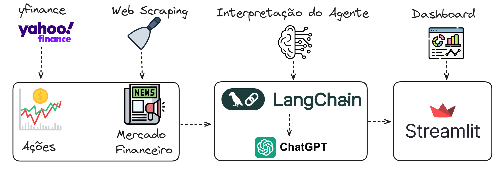

# Resumo Camarada
Este repositório contém um script em Python que gera um painel interativo utilizando Streamlit para fornecer um resumo completo do mercado financeiro. O painel é projetado para ser uma ferramenta abrangente e amigável para investidores e entusiastas do mercado financeiro, oferecendo uma visão detalhada e atualizada dos eventos e tendências do mercado. Entre as funcionalidades principais temos o agente desenvolvido com o gpt-4o, para interpretar as nóticias e interagir com  o usuário e a análise de desempenho de ações com a visualização de gráficos financeiros interativos.

Funcionalidades
Notícias do Mercado: Baixa e forne as notícias atuais do mercado financeiro do site InfoMoney para o agente.
Resumo dos Últimos Dias: Baixa e exibe notícias do mercado dos últimos dias.
Análise de Ações: Permite selecionar ações específicas e visualizar gráficos de cotação intraday e gráficos de candlestick.

Baixo temos o fluxograma do projeto:

